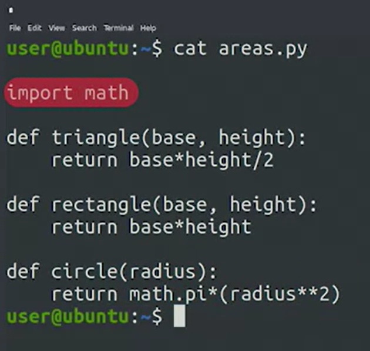
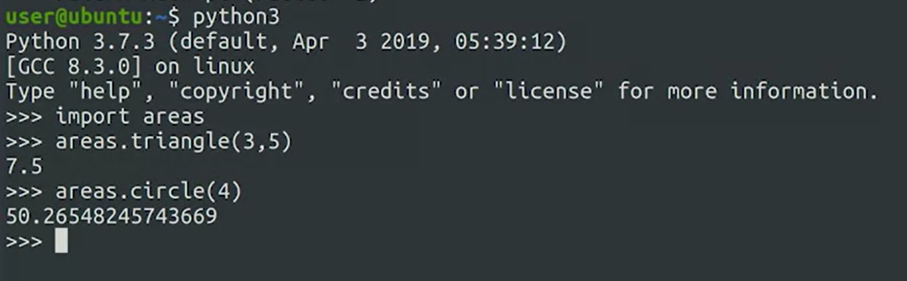
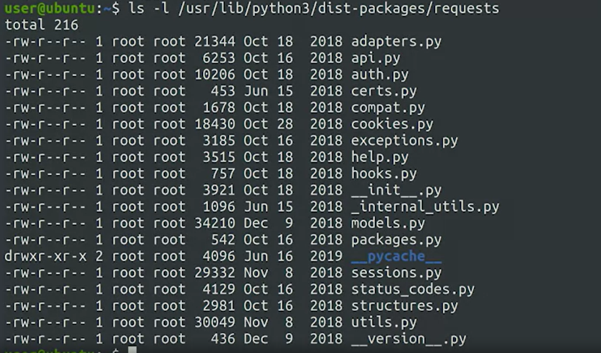

# CODE_REUSABILITY by using FUNCTIONS & MODULES
In programming, we often reuse code that we've written or someone else has written. This is called code reuse and nearly all languages provide some way of doing it. For code reusability we use functions and module. Functions let us group code into logical blocks that can be executed at a later point and as many times as we need. 

To prodcue our own Python module by putting the contents that we want to be part of the module into a separate file. To use a module, we'll *** import it using the filename*** . We can ***access each function, class, and variable defined in the file by using dot notation.*** Supose that ,  we have a file called areas.py which contains functions to calculate the area of different geometrical figures. 

Note that: if a function in the module  uses anothe module (in our case that is the math.pi constant) we need to import this module at the top so that we can use it.



How to use it: 
- Fist we need to import this moules. 
- Second we specify this module and sub functions and give the arguments. 

For example:

```python3

# we are now in interactive interpreter:

python3

import areas

areas.circle(10)
areas.triangle(3,5)
areas.rectangle(4,6)

```

## MODULES:

if we have complex modules structure, that has much more modules and sub modules we place all or the in a directory.
Our areas module is pretty small and simple. So it fits nicely in just one file. In some cases, the code we're working with can become more complex. It might make sense to split into submodules. In this case, we create a directory, the name of the module, and separate.py files for each of the submodules. To see what we mean, let's look at a list of files shipped by a module installed on this computer. The request module using the ls-l command.




This module is super complex. So all the things it does are split into separate files. Notice that init.py file. This is a special file. It's red when the module gets imported and it's used by the interpreter to check if a directory with Python files should it be a module. So if you have a module split into separate files, and you want the interpreter to recognize the directory has a module, you'll need to create the init.py file. If you don't have anything to put in this file, you need to create it. You can leave it empty but it needs to exist for the interpreter to recognize directory as a Python module. Wow, That was a lot stuff to grasp. But now we know how to create our own executable files and modules. It's a little complex so don't worry if you feel a little shaky on it right now. We'll keep practicing these concepts until you can do them in your sleep.

***__init.py__*** file must be in the directory, so that python_interpreter can understand, that this directory is a modul.  


# GOOD TO READ

After you’ve installed Python and checked that it works, the next step to set up your developer environment is to choose your main code editor.

These are some of the common editors for Python, available for all platforms:

[Eclipse](https://www.eclipse.org/)

[PyCharm](https://www.jetbrains.com/pycharm/)

[Sublime Text](http://www.sublimetext.com/)

[Visual Studio Code](https://code.visualstudio.com/)

You can read more about these editors, and others, in these overview comparatives:

[Python IDEs and Code Editors (Guide)](https://realpython.com/python-ides-code-editors-guide/#pycharm)

[Best Python IDEs and Code Editors](https://www.softwaretestinghelp.com/python-ide-code-editors/)

[Top 5 Python IDEs for Data Science](https://www.datacamp.com/tutorial/data-science-python-ide)

We encourage you to try out these editors and pick your favorite. Then, install it on your computer and experiment with writing and executing Python scripts locally.