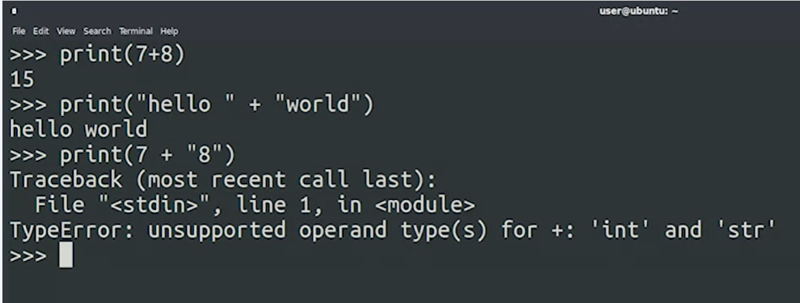
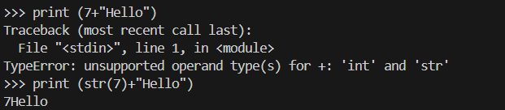
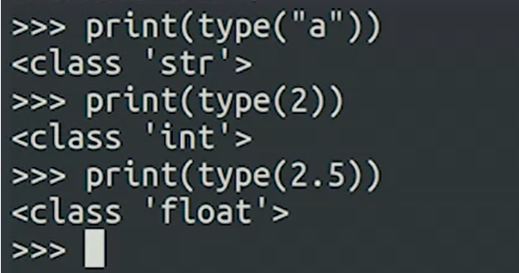

## Data Types

Data Types in python:
1. String
2. Integer: represents whole numbers.
3. Floats: represents real numbers.
4. Boolean

````

````


***Python cant itself combine tow different data types. *** 

   

***As seen inthe message "TypeError: unsupported operand type(s) for +: 'int' and 'str'"; to achive that we use methods to change data types andt than we can combine teses datas.***

  

***to get the info which Data type? we use "type()" Function***




***In Python, text in between quotes -- either single or double quotes -- is a string data type. An integer is a whole number, without a fraction, while a float is a real number that can contain a fractional part. For example, 1, 7, 342 are all integers, while 5.3, 3.14159 and 6.0 are all floats. When attempting to mix incompatible data types, you may encounter a TypeError. You can always check the data type of something using the type() function.***

