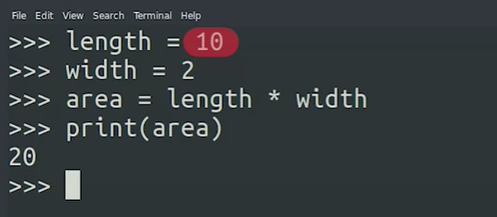
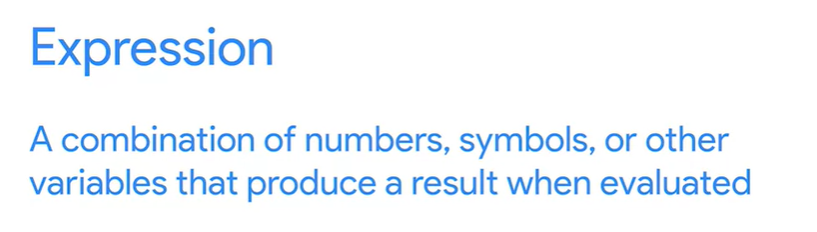
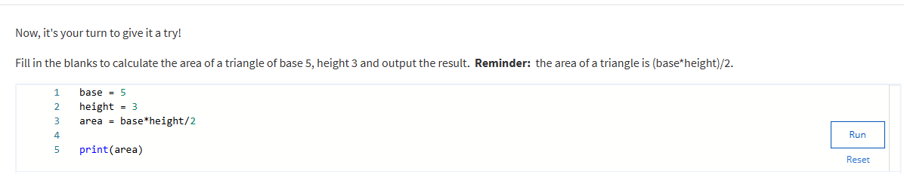
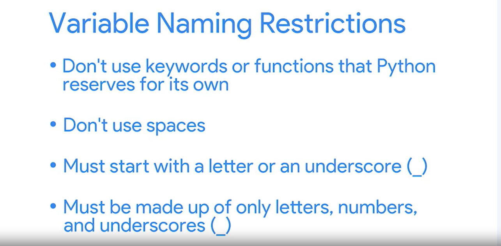
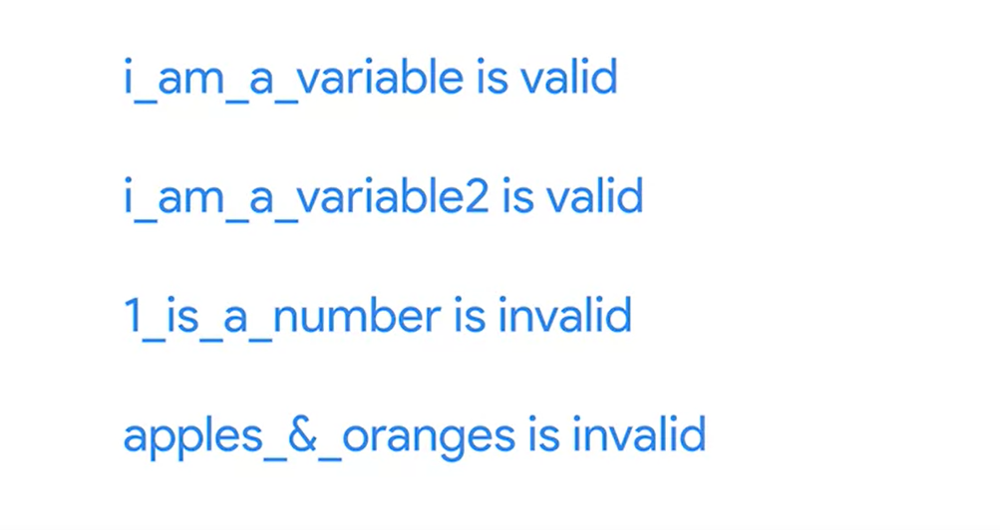

## Variables

Wenn wir einen Computer bitten, eine Operation für uns durchzuführen, müssen wir normalerweise Werte speichern und ihnen Namen geben, damit wir später darauf verweisen können. Dies ist, wo Variablen nützlich sind. Variablen sind Namen, die wir bestimmten Werten in unseren Programmen geben. Diese Werte können von einem beliebigen Datentyp sein; Zahlen, Zeichenfolgen oder sogar die Ergebnisse von Operationen. Wir haben bereits Variablen in einigen unserer ersten Beispiele verwendet, wie sie zum Speichern eines Namens oder eines Wertes. Jetzt werden wir genau lernen, wie sie funktionieren und wie man das Beste aus ihnen herausholen kann. Stellen Sie sich Variablen als Container für Daten vor. Wenn Sie eine Variable in Ihrem Code erstellen, reserviert Ihr Computer einen Teil seines eigenen Speichers, um diesen Wert zu speichern. Auf diese Weise kann der Computer später auf die Variable zugreifen, um den Wert zu lesen oder zu ändern. Lassen Sie uns das in Aktion sehen. Stellen Sie sich ein einfaches Skript vor, das die Fläche eines Rechtecks mit dem Formelbereich berechnet, entspricht Länge mal Breite. Fläche, Länge und Breite können alle durch Variablen wie diese dargestellt werden.   

  

 In diesem Skript erstellen wir drei Variablen und speichern verschiedene Werte in jedem. Der Prozess des Speicherns eines Wertes innerhalb einer Variablen wird Zuweisung genannt. Hier weisen wir der Längenvariablen den Wert von 10. Wir weisen der Breitenvariablen den Wert von zwei zu und wir weisen die Flächenvariable mit dem Ergebnis der Ausdruckslänge mal Breite zu.   
 
 
 Ein Eypression/Ausdruck ist eine Kombination aus Zahlen, Symbolen oder anderen Variablen, die bei der Auswertung ein Ergebnis erzeugen.    
 
 
 
 In diesem Beispiel multiplizieren wir den Wert von zwei Variablen, um den Wert zu erreichen, den wir wollen. Schließlich verwenden wir unseren alten Freund die Druckfunktion, um den Wert des Bereichs auf dem Bildschirm anzuzeigen. In Ordnung. Wir haben gerade gesehen, wie man Variablen Werte zuweist, Ausdrücke verwendet, um komplexere Werte zu berechnen und dann den Inhalt einer Variablen zu drucken. Variablen sind wichtig bei der Programmierung, da sie Sie Operationen an Daten ausführen können, die sich ändern können. Wenn wir beispielsweise unser Rechteck-Skript erweitert haben, um jede Eingabe als Wert der Variablen Länge und Breite zu akzeptieren, könnten wir die Fläche eines Rechtecks beliebiger Größe berechnen oder ein eher IT-fokussiertes Beispiel geben, sagen wir, wir haben ein Skript, das eine bestimmte Operation für eine Datei ausführt. Wir können dieses Skript erweitern, um den gleichen Vorgang für jede Datei auszuführen, aber nur, wenn das Programm eine Variable verwendet, um den Dateinamen zu speichern.   
 

 Sie haben vielleicht bemerkt, dass wir einen Wert zu einer Variablen zuweisen, indem Sie das Gleichheitszeichen in Form von Variable Gleichheitswert verwenden. Im Allgemeinen können Sie Variablen benennen, was auch immer Sie möchten, aber es gibt einige Einschränkungen.    
 
 
 
 Erstens sollten Sie nicht als Variablennamen eines der Schlüsselwörter oder Funktionen verwenden, die Python für seine eigenen reserviert, wie Print. Die Verwendung dieser reservierten Begriffe macht Ihr Programm verwirrend zu lesen und führt zu Fehlern. Python hat auch einige Einschränkungen für die Zeichen, die Sie verwenden können, um eine Variable zu definieren. Variablennamen dürfen keine Leerzeichen haben, und sie müssen entweder mit einem Buchstaben oder einem Unterstrich beginnen. Außerdem können sie nur aus Buchstaben, Zahlen und Unterstrichen bestehen. Schauen wir uns einige Beispiele für gültige und ungültige Variablennamen an, um dies besser zu verstehen.   
 

I_AM_A_Variable ist der gültige Variablenname.
I_AM_A_Variable2 ist auch ein gültiger Variablenname. 1_is_a_number ist ungültig, da Variablennamen mit einem Buchstaben oder Unterstrich beginnen müssen. Apples_&_Oranges ist ungültig, da das Sonderzeichen oberhalb der Hand verwendet wird. Letzte Sache, denken Sie daran, dass Präzision wichtig ist, wenn die Programmierung. Python-Variablen berücksichtigen Groß-/Kleinschreibung, daher ist die Großschreibung wichtig. Kleinbuchstaben Name, Großbuchstaben und Großbuchstaben Name sind alle gültig und unterschiedliche Variablennamen, und diese Regel für Variablen ist unveränderlich.