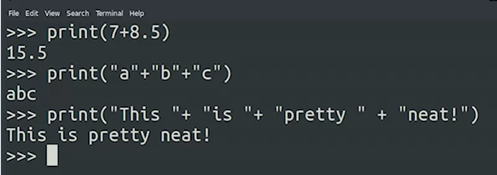
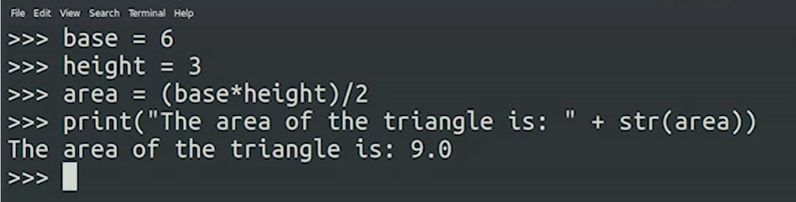
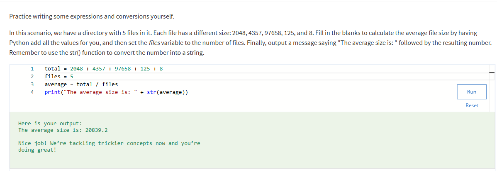

## Expressions  

### Implicit vs Explicit Conversion   

As we saw earlier in the video, some data types can be mixed and matched due to implicit conversion. Implicit conversion is where the interpreter helps us out and automatically converts one data type into another, without having to explicitly tell it to do so.

By contrast, explicit conversion is where we manually convert from one data type to another by calling the relevant function for the data type we want to convert to. We used this in our video example when we wanted to print a number alongside some text. Before we could do that, we needed to call the str() function to convert the number into a string. Once the number was explicitly converted to a string, we could join it with the rest of our textual string and print the result.   

-----

In einem früheren Video haben wir gesehen, dass wir den Plus-Operator nicht zwischen einer Ganzzahl und einer Zeichenfolge verwenden können, da es sich um unterschiedliche Datentypen handelt. Aber was passiert, wenn wir stattdessen versuchen, mit einer Ganzzahl und einem Float zu arbeiten? Lass es uns herausfinden: 

Python ist fehlerfrei und hat kein Problem damit, diesen Vorgang auszuführen. Aber was hat es damit auf sich? Sind Integer und Floats nicht zwei verschiedene Datentypen? Das sind sie sicher, aber unter der Haube passiert hier viel. Hinter den Kulissen ist der Computer damit beschäftigt, unsere Ganzzahl Sieben automatisch in eine Fließkommazahl Sieben umzuwandeln. Dadurch kann Python dann die Werte addieren, um ein Ergebnis zurückzugeben, das ebenfalls ein Float ist. Wir nennen diesen Prozess ***implizite Konvertierung***. Der Interpreter konvertiert automatisch einen Datentyp in einen anderen. Wir haben das schon einmal erwähnt, aber es lohnt sich, noch einmal hervorzuheben, dass Python-Operationen nicht nur auf Zahlen beschränkt sind. Sie können auch den Plus-Operator verwenden, um Zeichenketten zu addieren. 
 
Was ist also möglich, wenn Sie wirklich eine Zeichenfolge und eine Zahl kombinieren möchten? Das ist es sicher, aber nur mit einer expliziten Konvertierung. Um in Python zwischen einem Datentyp und einem anderen zu konvertieren, rufen wir eine Funktion mit dem Namen des Typs auf, in den wir konvertieren. Schauen wir mal, wie das funktioniert.    
 
 
 
 
Jetzt werden die Dinge etwas komplexer. Nehmen wir uns einen Moment Zeit, um das auszupacken, um sicherzustellen, dass alles Sinn macht. [auf dem Bildschirm] Basis = 6 [auf dem Bildschirm] Höhe = 3 In diesem Skript berechnen wir zuerst die Fläche eines Dreiecks, [auf dem Bildschirm] area = (base*height) /2 und wenn wir es drucken, fügen wir es zu einer Zeichenfolge hinzu. [on screen] print („Die Fläche des Dreiecks ist:" + str (area)) Dazu müssen wir die Funktion str () aufrufen, um eine Zahl in eine Zeichenfolge umzuwandeln. Lassen Sie uns es ausführen und überprüfen, was passiert.  Die Fläche des Dreiecks ist: 9,0 Unsere Zahl wurde in eine Zeichenfolge umgewandelt und zusammen mit der Nachricht gedruckt. 

 
