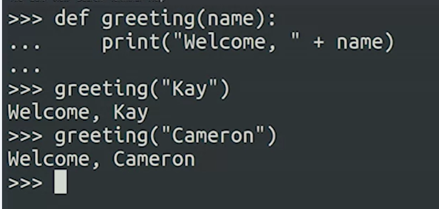
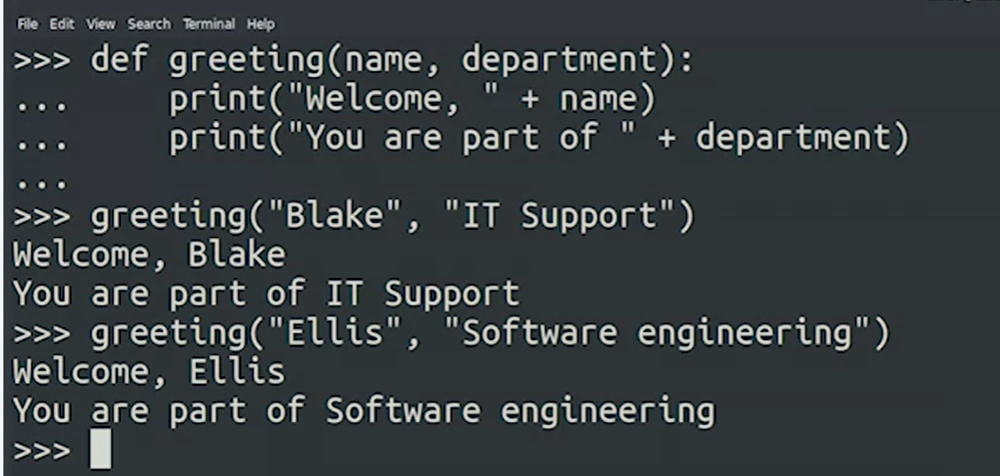

## Functions

Functions take parameters

   

Functions can take more than one parameter:

   

We looked at a few examples of built-in functions in Python, but being able to define your own functions is incredibly powerful. We start a function definition with the def keyword, followed by the name we want to give our function. After the name, we have the parameters, also called arguments, for the function enclosed in parentheses. A function can have no parameters, or it can have multiple parameters. Parameters allow us to call a function and pass it data, with the data being available inside the function as variables with the same name as the parameters. Lastly, we put a colon at the end of the line.

After the colon, the function body starts. It’s important to note that in Python the function body is delimited by indentation. This means that all code indented to the right following a function definition is part of the function body. The first line that’s no longer indented is the boundary of the function body. It’s up to you how many spaces you use when indenting -- just make sure to be consistent. So if you choose to indent with four spaces, you need to use four spaces everywhere in your code.