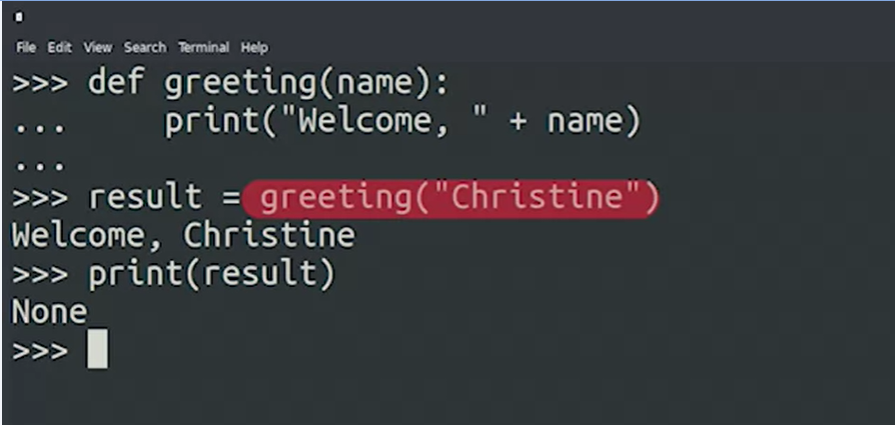
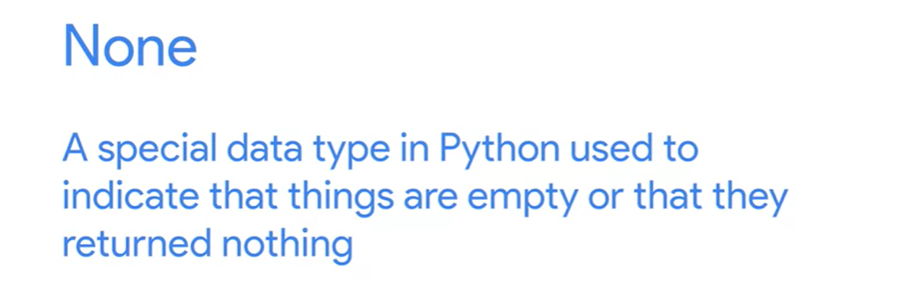
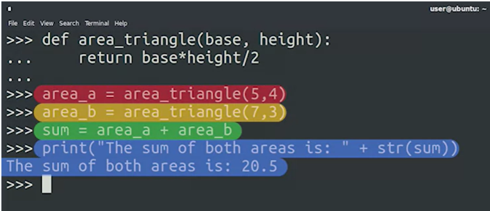
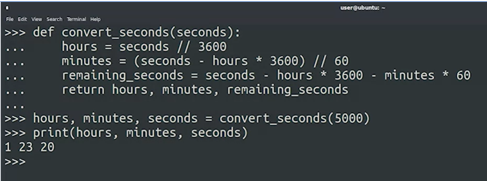
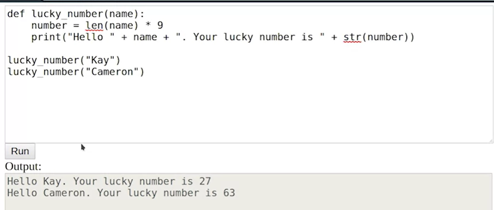

## Return Value
Sometimes we don't want a function to simply run and finish. We may want a function to manipulate data we passed it and then return the result to us. This is where the concept of return values comes in handy. We use the return keyword in a function, which tells the function to pass data back. When we call the function, we can store the returned value in a variable. Return values allow our functions to be more flexible and powerful, so they can be reused and called multiple times.

Functions can even return multiple values. Just don't forget to store all returned values in variables! You could also have a function return nothing, in which case the function simply exits.   

If a funtion has no return statement, it would retun no vlue:    

itreturn  ***none***

    

