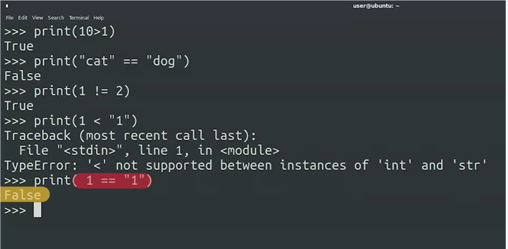
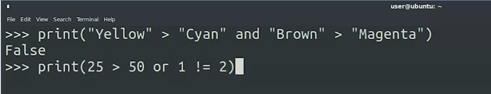
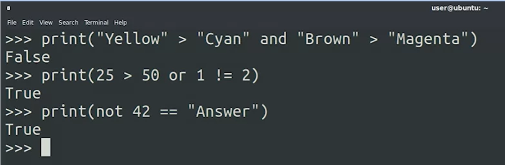

## Conditionals

### Comparison Operators  

In Python, we can use comparison operators to compare values. When a comparison is made, Python returns a ***boolean*** result, or simply a ***True*** or ***False***. 

To check if two values are the same, we can use the equality operator: ***==*** 

To check if two values are not the same, we can use the not equals operator: ***!=*** 

We can also check if values are greater than or lesser than each other using > and <. If you try to compare data types that aren’t compatible, like checking if a string is greater than an integer, Python will throw a TypeError. 

### Logical Operators. 

We can make very complex comparisons by joining statements together using logical operators with our comparison operators. These logical operators are and, or, and not. When using the and operator, both sides of the statement being evaluated must be true for the whole statement to be true. When using the or operator, if either side of the comparison is true, then the whole statement is true. Lastly, the not operator simply inverts the value of the statement immediately following it. So if a statement evaluates to True, and we put the not operator in front of it, it would become False.

Combine multiple conditions with logical operators

***and***   ***or***    

    

    

    

