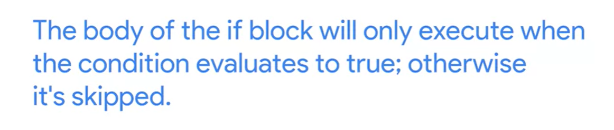

## Conditionals

### Comparison Operators  

In Python, we can use comparison operators to compare values. When a comparison is made, Python returns a ***boolean*** result, or simply a ***True*** or ***False***. 

To check if two values are the same, we can use the equality operator: ***==*** 

To check if two values are not the same, we can use the not equals operator: ***!=*** 

We can also check if values are greater than or lesser than each other using > and <. If you try to compare data types that aren’t compatible, like checking if a string is greater than an integer, Python will throw a TypeError. 


### Logical Operators. 

We can make very complex comparisons by joining statements together using logical operators with our comparison operators. These logical operators are and, or, and not. When using the and operator, both sides of the statement being evaluated must be true for the whole statement to be true. When using the or operator, if either side of the comparison is true, then the whole statement is true. Lastly, the not operator simply inverts the value of the statement immediately following it. So if a statement evaluates to True, and we put the not operator in front of it, it would become False.

Combine multiple conditions with logical operators

***and***   ***or***    

    

    

    


### Branching

    

We can use the concept of branching to have our code alter its execution sequence depending on the values of variables. We can use an if statement to evaluate a comparison. We start with the if keyword, followed by our comparison. We end the line with a colon. The body of the if statement is then indented to the right. If the comparison is True, the code inside the if body is executed. If the comparison evaluates to False, then the code block is skipped and will not be run.   

 

     

   

   

### else Statement   

We just covered the if statement, which executes code if an evaluation is true and skips the code if it’s false. But what if we wanted the code to do something different if the evaluation is false? We can do this using the else statement. The else statement follows an if block, and is composed of the keyword else followed by a colon. The body of the else statement is indented to the right, and will be executed if the above if statement doesn’t execute.

   

    

***See  have two return without else statement***
 


### elif Statement   

The if-block will be executed if condition1 is True.    

***The elif-block will be executed if condition1 is False and condition2 is True.***    

The else block will be executed when all the specified conditions are false.

Building off of the if and else blocks, which allow us to branch our code depending on the evaluation of one statement, the elif statement allows us even more comparisons to perform more complex branching. Very similar to the if statements, an elif statement starts with the elif keyword, followed by a comparison to be evaluated. This is followed by a colon, and then the code block on the next line, indented to the right. An elif statement must follow an if statement, and will only be evaluated if the if statement was evaluated as false. You can include multiple elif statements to build complex branching in your code to do all kinds of powerful things!

elif statement is more practiker as this statement:   

 


and 
 

Actually elif-block is a companion to if-block. 

## Che-She

### Conditionals Cheat Sheet
In earlier videos, we took a look at some of the built-in Python operators that allow us to compare values, and some logical operators we can use to combine values. We also learned how to use operators in if-else-elif blocks. 

It’s a lot to learn but, with practice, it gets easier to remember it all. In the meantime, this handy cheat sheet gives you all the information you need at a glance. 

### Comparison operators
a == b: a is equal to b

a != b: a is different than b

a < b: a is smaller than b

a <= b: a is smaller or equal to b

a > b: a is bigger than b

a >= b: a is bigger or equal to b

### Logical operators
a and b: True if both a and b are True. False otherwise.

a or b: True if either a or b or both are True. False if both are False.

not a: True if a is False, False if a is True.

### Branching blocks

In Python, we branch our code using if, else and elif. This is the branching syntax:

````
if condition1:
	if-block
elif condition2:
	elif-block
else:
	else-block

````
Remember: The if-block will be executed if condition1 is True. The elif-block will be executed if condition1 is False and condition2 is True. The else block will be executed when all the specified conditions are false.


