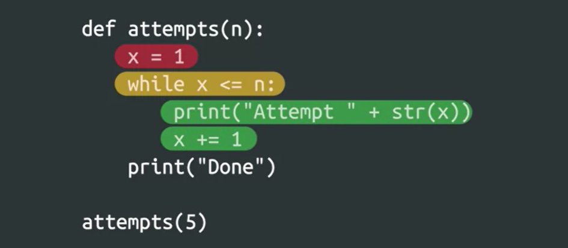

## While Loop

A while loop will continuously execute code depending on the value of a condition. It begins with the keyword while, followed by a comparison to be evaluated, then a colon. On the next line is the code block to be executed, indented to the right. Similar to an if statement, the code in the body will only be executed if the comparison is evaluated to be true. What sets a while loop apart, however, is that this code block will keep executing as long as the evaluation statement is true. Once the statement is no longer true, the loop exits and the next line of code will be executed.  

Bevor wir es ausführen, um es herauszufinden, lassen Sie uns es gemeinsam Zeile für Zeile durchgehen. In der ersten Zeile weisen wir der Variablen x den Wert 0 zu. Wir nennen diese Aktion Initialisierung, um einer Variablen einen Anfangswert zu geben.

### While Loop inside a Function

    

***An Example of Code that ask user bane ubtill a valid name provided.***

### Initialzig a Variable by While-Loops is very important   

You'll want to watch out for a common mistake: forgetting to initialize variables. If you try to use a variable without first initializing it, you'll run into a NameError. This is the Python interpreter catching the mistake and telling you that you’re using an undefined variable. The fix is pretty simple: initialize the variable by assigning the variable a value before you use it.

   
As we initialize a variable the error will be off. 

Another common mistake to watch out for that can be a little trickier to spot is forgetting to initialize variables with the correct value. If you use a variable earlier in your code and then reuse it later in a loop without first setting the value to something you want, your code may wind up doing something you didn't expect. Don't forget to initialize your variables before using them!

### Infinitive Loops and Code Blocks
