## For Loop

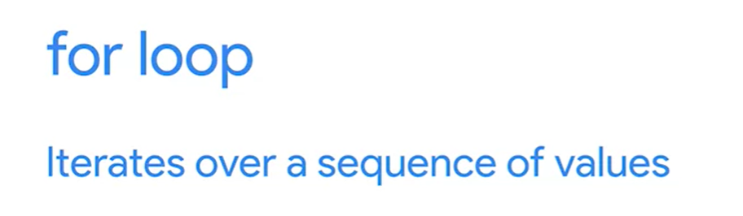    

For loops allow you to iterate over a sequence of values. Let's take the example from the beginning of the video:

for x in range(5):

  print(x)

Similar to if statements and while loops, for loops begin with the keyword for with a colon at the end of the line. Just like in function definitions, while loops and if statements, the body of the for loop begins on the next line and is indented to the right. But what about the stuff in between the for keyword and the colon? In our example, we’re using the range() function to create a sequence of numbers that our for loop can iterate over. In this case, our variable x points to the current element in the sequence as the for loop iterates over the sequence of numbers. Keep in mind that in Python and many programming languages, a range of numbers will start at 0, and the list of numbers generated will be one less than the provided value. So range(5) will generate a sequence of numbers from 0 to 4, for a total of 5 numbers.


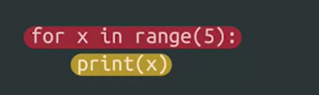    

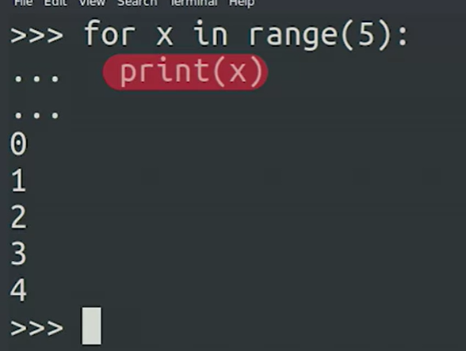  
Bringing this all together, the range(5) function will create a sequence of numbers from 0 to 4. Our for loop will iterate over this sequence of numbers, one at a time, making the numbers accessible via the variable x and the code within our loop body will execute for each iteration through the sequence. So for the first loop, x will contain 0, the next loop, 1, and so on until it reaches 4. Once the end of the sequence comes up, the loop will exit and the code will continue.


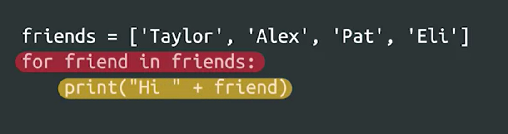    

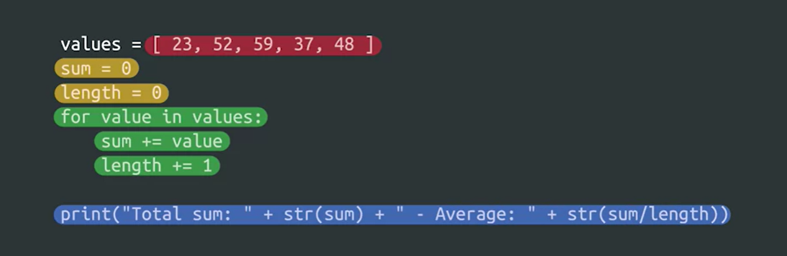   
The power of for loops comes from the fact that it can iterate over a sequence of any kind of data, not just a range of numbers. You can use for loops to iterate over a list of strings, such as usernames or lines in a file.
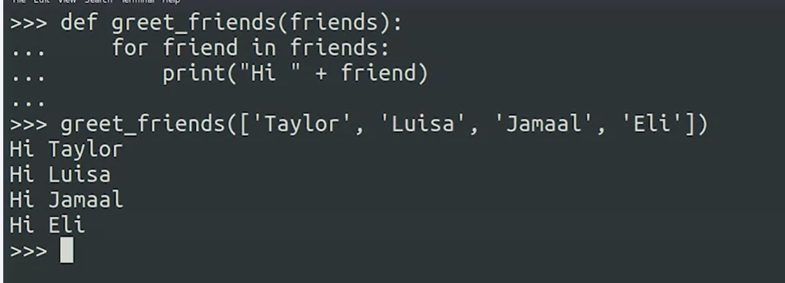 

***Strings are iterable***
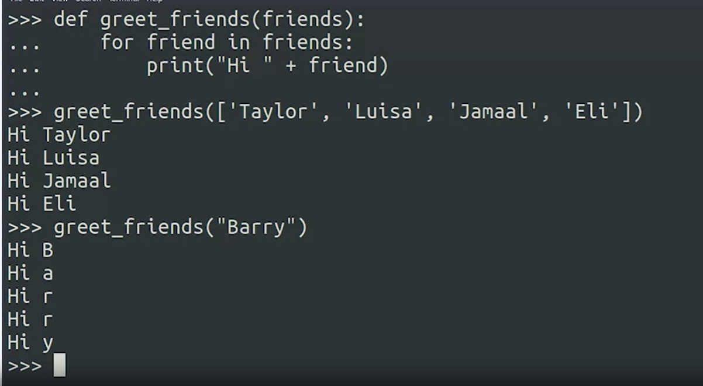
 
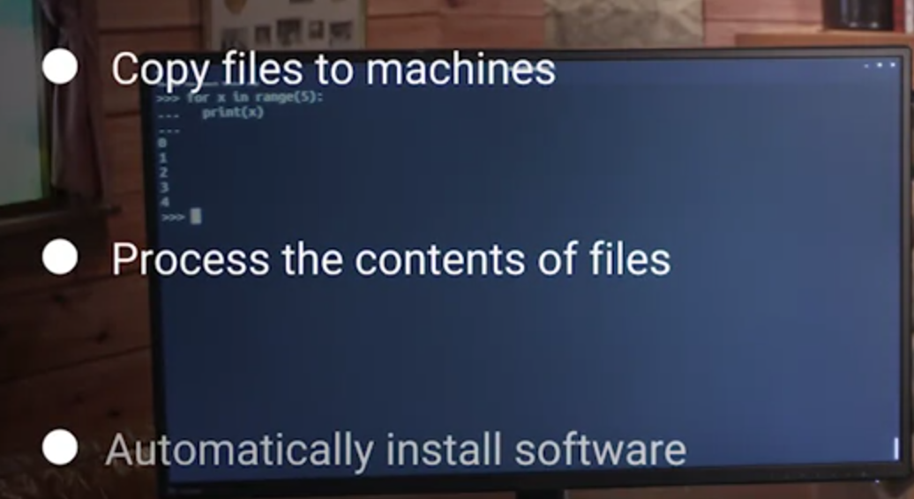   

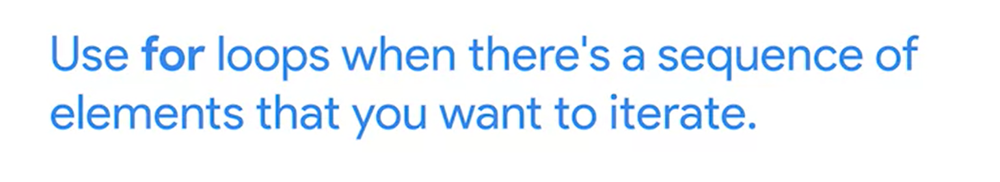    

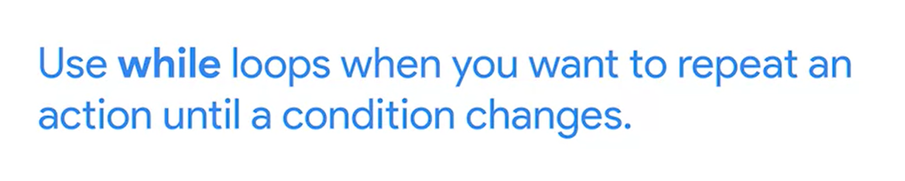
Not sure whether to use a for loop or a while loop? Remember that a while loop is great for performing an action over and over until a condition has changed. A for loop works well when you want to iterate over a sequence of elements

### Range Function

The in keyword, when used with the range() function, generates a sequence of integer numbers, which can be used with a for loop to control the start point, the end point, and the incremental values of the loop.  

````
for n in range(x, y, z):
    print(n)

````
The range() function uses a set of indices that point to integer values, which start at the number 0. The numeric values 0, 1, 2, 3, 4 correlate to ordinal index positions 1st, 2nd, 3rd, 4th, 5th. So, when a range call to the 5th index position is made using range(5) the index is pointing to the numeric value of 4.


The range() function can take up to three parameters:  range(start, stop, step) 

Start 
The first item in the range() function parameters is the starting position of the range. The default is the first index position, which points to the numeric value 0. This value is included in the range. 

Stop
The second item in the range() function parameters is the ending position of the range. There is no default index position, so this index number must be given to the range() parameters. For example, the line for n in range(4) will loop 4 times with the n variable starting at 0 and looping 4 index positions: 0, 1, 2, 3. As you can see, range(4) (meaning index position 4) ends at the numeric value 3. In Python, this structure may be phrased as “the end-of-range value is excluded from the range.” In order to include the value 4 in  range(4), the syntax can be written as range(4+1) or range(5). Both of these ranges will produce the numeric values 0, 1, 2, 3, 4. 

Step
The third item in the range() function parameters is the incremental step value. The default increment is +1. The default value can be overridden with any valid increment. However, note that the loop will still end at the end-of-range index position, regardless of the incremental value. For example, if you have a loop with the range: for n in range(1, 5, 6), the range will only produce the numeric value 1. This is because the incremental value of 6 exceeded the ending point of the range.


Practice Exercise
You can use the code block below to test the values of n with various range() parameters. A few suggestions to test are:

range(stop)

- range(3) 

- range(3+1) 

range(start, stop)

- range(2, 6)     

- range(5,10+1) 

range(start, stop, step)

- range(4, 15+1, 2)         

- range(2*2, 25, 3+2) 

- range(10, 0, -2)  

````
for n in range(1, 5, 6):  
    print(n)
````

#### Examples of the range() function in code:
Example 1

````
# This loop iterates on the value of the "n" variable in a range
# of 0 to 10 (the value of the end-of-range index 11 is excluded).
# The incremental value for the loop is 2. The print() function will 
# output the resulting value of "n" as the loop counts from 0 to 10 
# (end-of-range index 11) in incremental steps of 2. This is one 
# method that can be used in Python to print a list of even numbers.


for n in range(0,11,2):
    print(n)


# The loop should print 0, 2, 4, 6, 8, 10

0
2
4
6
8
10
````

 Example 2  

 ````
# This loop iterates on the value of the "number" variable in a range
# of 2 to 7+1 (the value of the end-of-range index 7 is excluded, so 
# +1 has been added to the parameter to include the numeric value 7 in 
# the range). The incremental value for the loop is the default of +1.
# The print() function will output the resulting value of "number" 
# multiplied by 3.


for number in range(2,7+1):
    print(number*3)


# The loop should print 6, 9, 12, 15, 18, 21

6
9
12
15
18
21
 ````

 Example 3  

 ````
# This loop iterates on the value of the "x" variable in a range
# of 2 to -1 (the end-of-range index -2 is excluded). The third 
# parameter is also a negative number, making it a decremental value
# of -1. The print() function will output the resulting value of
# "x" as it starts at 2 and counts down to -1 (index -2).


for x in range(2, -2, -1):
    print(x)


# The loop should print 2, 1, 0, -1


2
1
0
-1
  ````

#### Key takeaways
The roles of the range(start, stop, step) function parameters are:

- Start - Beginning of range

     value included in range

     default = 0

- Stop - End of range

    value excluded from range (to include, use stop+1)

    no default

    must provide the ending index number 

- Step - Incremental value 

    default = 1


#### Resources for more information

https://www.geeksforgeeks.org/python-range-function/

https://www.python.org/shell/

https://www.onlinegdb.com/online_python_interpreter

https://repl.it/languages/python3

https://repl.it/languages/python3

https://repl.it/languages/python3

https://repl.it/languages/python3


## Nested For Loops


````
for left in range(7):
    for right in range(left,7):
        print("["+str(left)+"|"+str(right)+"]",end=" ")
    print()
````

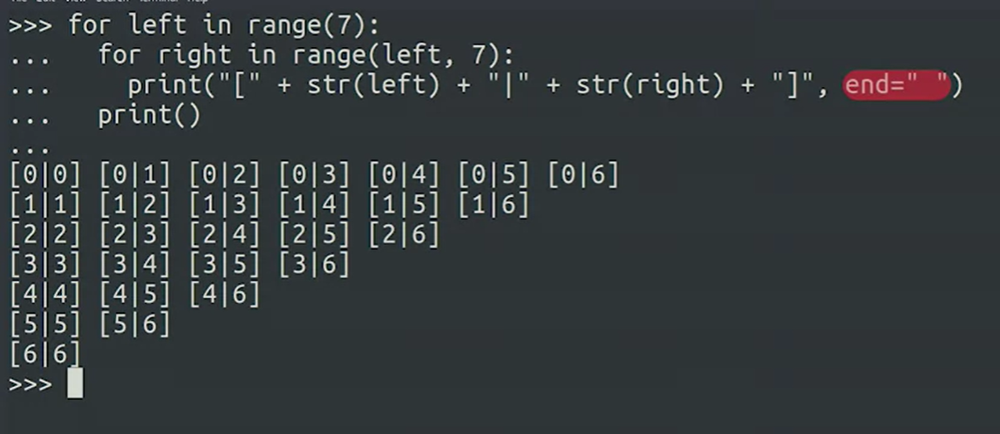


````

teams=["Dragons","Wolves","Pandas","Unicorns"]

for home_team in teams:
    for away_team in teams:
        if home_team != away_team:
            print(home_team + " vs "+ away_team)

````

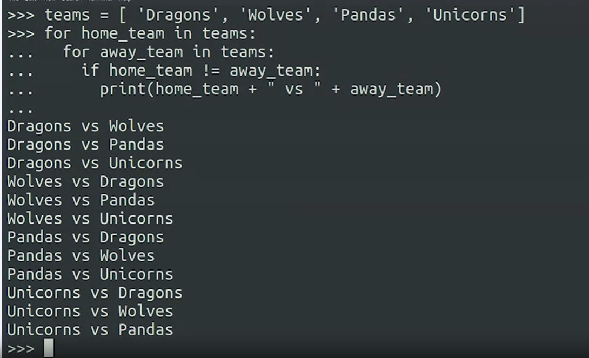


### Break & Continue

You can interrupt both while and for loops using the break keyword. We normally do this to interrupt a cycle due to a separate condition.

You can use the continue keyword to skip the current iteration and continue with the next one. This is typically used to jump ahead when some of the elements of the sequence aren’t relevant.

### Comman Pitfalls

***While Loops***
A while loop executes the body of the loop while the condition remains True.

Syntax:
````
while condition:
    body
````
Things to watch out for!

Failure to initialize variables. Make sure all the variables used in the loop’s condition  are initialized before the loop.

Unintended infinite loops. Make sure that the body of the loop modifies the variables used in the condition, so that the loop will eventually end for all possible values of the variables.

 Typical use:

While loops are mostly used when there’s an unknown number of operations to be performed, and a condition needs to be checked at each iteration.

***For Loops***
A for loop iterates over a sequence of elements, executing the body of the loop for each element in the sequence.

Syntax:
````
for variable in sequence:
    body
````
The range() function:

range() generates a sequence of integer numbers. It can take one, two, or three parameters:

- range(n): 0, 1, 2, ... n-1

- range(x,y): x, x+1, x+2, ... y-1

- range(p,q,r): p, p+r, p+2r, p+3r, ... q-1 (if it's a valid increment)

***Common pitfalls:***

- Forgetting that the upper limit of a range() isn’t included.

- Iterating over non-sequences. Integer numbers aren’t iterable. Strings are iterable letter by letter, but that might not be what you want.

Typical use:

For loops are mostly used when there's a pre-defined sequence or range of numbers to iterate.


