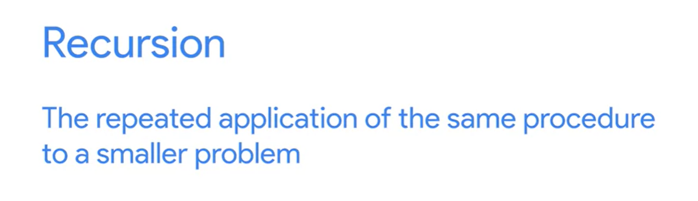
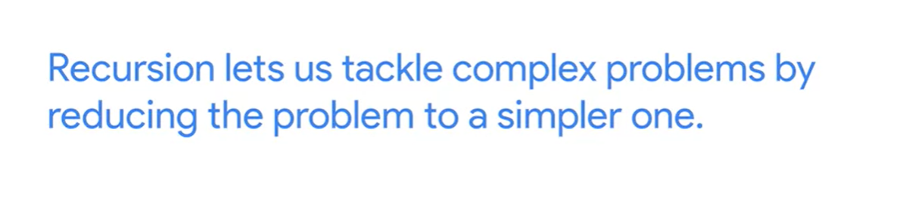
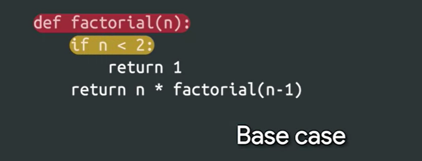
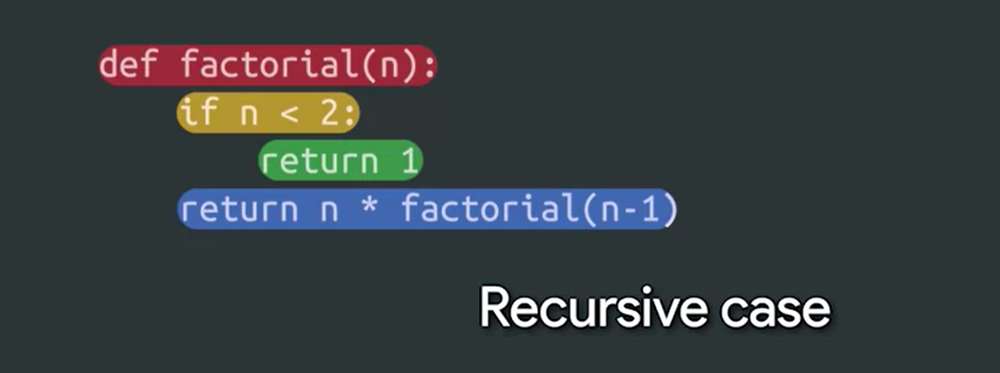
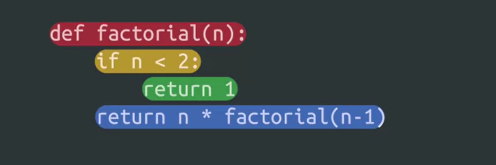
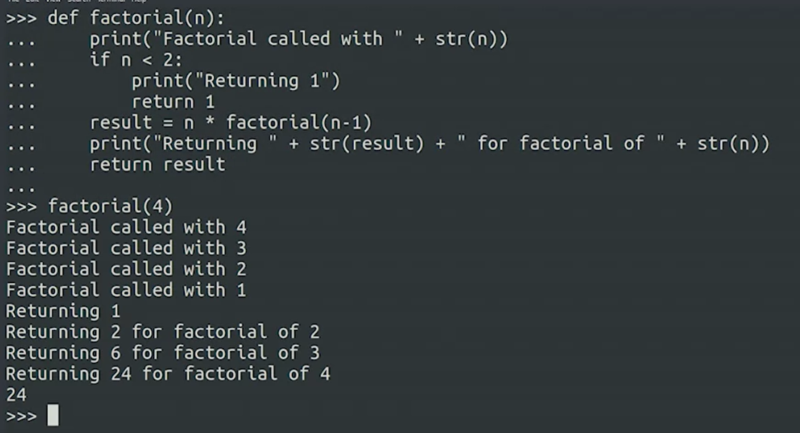

## Recursive Function

A recursive function must include a recursive case and base case. The recursive case calls the function again, with a different value. The base case returns a value without calling the same function.

A recursive function will usually have this structure:

````
def recursive_function(parameters):
    if base_case_condition(parameters):
        return base_case_value
    recursive_function(modified_parameters)
````
    

   

  

 

Schauen wir uns ein Beispiel für eine rekursive Funktion an, um zu verstehen, wovon wir sprechen. Hier definieren wir eine Funktion namens faktoriell. Zu Beginn der Funktion haben wir einen bedingten Block, der den Basisfall definiert, 

 


 def factorial (n): wobei n kleiner als 2 ist. [auf dem Bildschirm] wenn n < 2: Es gibt einfach den Wert 1 zurück. [auf dem Bildschirm] return 1 Nach dem Basisfall haben wir eine Zeile, in der sich die faktorielle Funktion mit n minus 1 selbst aufruft. [auf dem Bildschirm] return n * factorial (n-1) Dies wird als rekursiver Fall bezeichnet.

 
Dadurch entsteht eine Schleife. Jedes Mal, wenn die Funktion ausgeführt wird, ruft sie sich selbst mit einer kleineren Zahl auf, bis sie den Basisfall erreicht. 


 Sobald der Basisfall erreicht ist, wird der Wert 1 zurückgegeben. Dann multipliziert die zuvor aufgerufene Funktion das mit zwei und die zuvor aufgerufene Funktion multipliziert es mit drei und so weiter. Diese Schleife läuft so lange, bis die erste aufgerufene faktorielle Funktion das gewünschte Ergebnis zurückgibt. Es ist ein bisschen komplex. Lassen Sie uns ein paar Print-Statements hinzufügen, um zu sehen, wie das genau funktioniert.

 

The function sum_positive_numbers should return the sum of all positive numbers between the number n received and 1. For example, when n is 3 it should return 1+2+3=6, and when n is 5 it should return 1+2+3+4+5=15. Fill in the gaps to make this work:

````
def sum_positive_numbers(n):
    # The base case is n being smaller than 1
    if n < 1:
        return 0

    # The recursive case is adding this number to 
    # the sum of the numbers smaller than this one.
    return n + sum_positive_numbers(n-1)

print(sum_positive_numbers(3)) # Should be 6
print(sum_positive_numbers(5)) # Should be 15
````