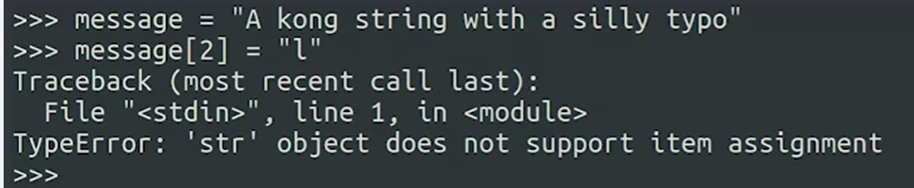
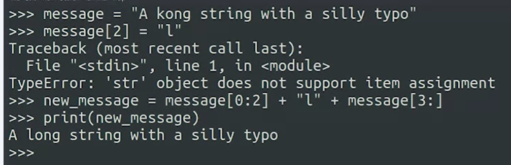
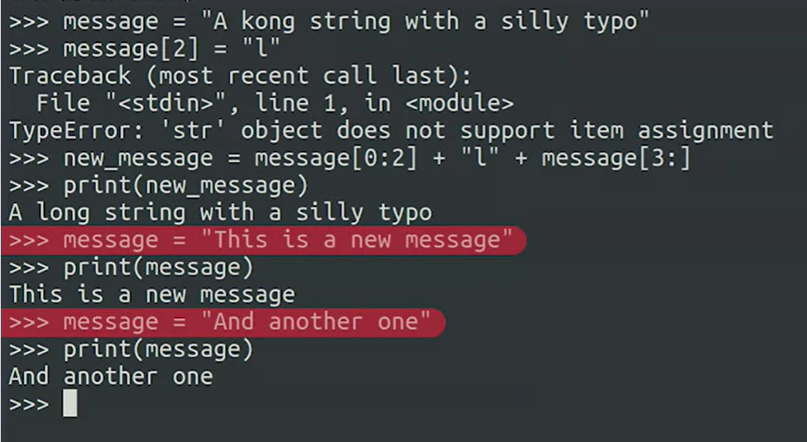

## New Strings

   

*** We can not asign any character of a string; because m strings in python immutableis. ***

    

***But we can do a new String.***

     

***Or we can assign the compkete string***

 

