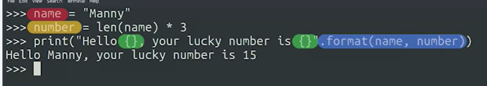
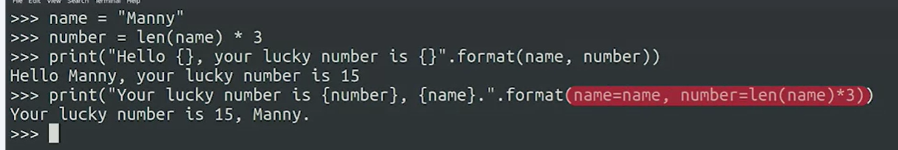
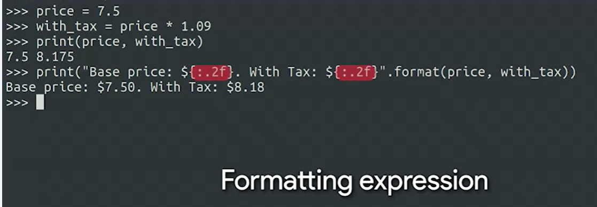
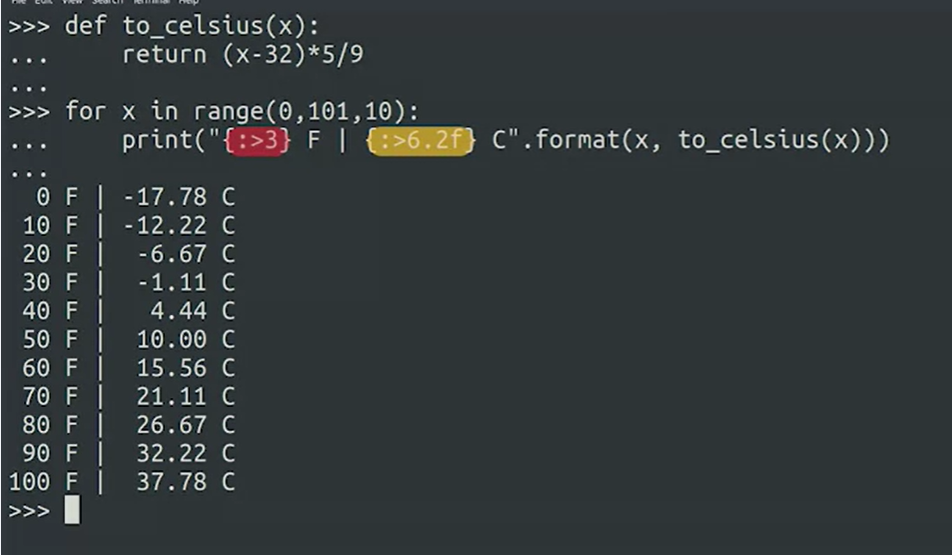

## Format String
You can use the format method on strings to concatenate and format strings in all kinds of powerful ways. To do this, create a string containing curly brackets, {}, as a placeholder, to be replaced. Then call the format method on the string using .format() and pass variables as parameters. The variables passed to the method will then be used to replace the curly bracket placeholders. This method automatically handles any conversion between data types for us. 


If the curly brackets are empty, they’ll be populated with the variables passed in the order in which they're passed. However, you can put certain expressions inside the curly brackets to do even more powerful string formatting operations. You can put the name of a variable into the curly brackets, then use the names in the parameters. This allows for more easily readable code, and for more flexibility with the order of variables.
   


*Modify the student_grade function using the format method, so that it returns the phrase "X received Y% on the exam". For example, student_grade("Reed", 80) should return "Reed received 80% on the exam".*

````
def student_grade(name, grade):
	return "{} received {}% on the exam".format(name,grade)

print(student_grade("Reed", 80))
print(student_grade("Paige", 92))
print(student_grade("Jesse", 85))
````

### Formatting expression
You can also put a formatting expression inside the curly brackets, which lets you alter the way the string is formatted. For example, the formatting expression {:.2f} means that you’d format this as a float number, with two digits after the decimal dot. The colon acts as a separator from the field name, if you had specified one. You can also specify text alignment using the greater than operator: >. For example, the expression {:>3.2f} would align the text three spaces to the right, as well as specify a float number with two decimal places. String formatting can be very handy for outputting easy-to-read textual output.
    

 