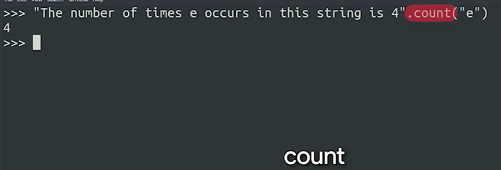

## String methods
    
In Python, strings are immutable. This means that they can't be modified. So if we wanted to fix a typo in a string, we can't simply modify the wrong character. We would have to create a new string with the typo corrected. We can also assign a new value to the variable holding our string.

If we aren't sure what the index of our typo is, we can use the string method index to locate it and return the index. Let's imagine we have the string "lions tigers and bears" in the variable animals. We can locate the index that contains the letter g using animals.index("g"), which will return the index; in this case 8. We can also use substrings to locate the index where the substring begins. animals.index("bears") would return 17, since that’s the start of the substring. If there’s more than one match for a substring, the index method will return the first match. If we try to locate a substring that doesn't exist in the string, we’ll receive a ValueError explaining that the substring was not found.

We can avoid a ValueError by first checking if the substring exists in the string. This can be done using the in keyword. We saw this keyword earlier when we covered for loops. In this case, it's a conditional that will be either True or False. If the substring is found in the string, it will be True. If the substring is not found in the string, it will be False. Using our previous variable animals, we can do "horses" in animals to check if the substring "horses" is found in our variable. In this case, it would evaluate to False, since horses aren’t included in our example string. If we did "tigers" in animals, we'd get True, since this substring is contained in our string.


***Index() Method***   
Gets the index of the given character or substring. 

  


*!Index Method just retiúns he first occurance of the given parameter*

 

***Using the index method, find out the position of "x" in "supercalifragilisticexpialidocious".***
````
word = "supercalifragilisticexpialidocious"
print(word.index('x'))

````
*If the substring is not there, method returns a value error.*


***Use "in" keyword to avoid getting error ba trying to get index of a substring.***


Lets replace the old domain with newones of all email adresses: 

````
def replace_domain(email, old_domain, new_domain):
    if '@' + old_domain in email:
        index=email.index("@"+old_domain)
        mew_email=old_email[:index]+"@"+new_domain
        return new_email
    return email # if email does not containe the # old domain just return the email as itself 
    
````
   


### More Methods

The goal is not memorize all methods, just how to find and use to do what we want. 

We've covered a bunch of String class methods already, so let's keep building on those and run down some more advanced methods.

The string method ***lower*** will return the string with all characters changed to lowercase.    

The inverse of this is the ***upper***  method, which will return the string all in uppercase.     
    

Just like with previous methods, we call these on a string using ***dot notation***, like "this is a ***string".upper()***. This would return the string ***"THIS IS A STRING"***. This can be super handy when checking user input, since someone might type in all lowercase, all uppercase, or even a mixture of cases.   
   

You can use the ***strip*** method to remove surrounding whitespace from a string. Whitespace includes spaces, tabs, and newline characters. You can also use the methods  ***lstrip*** and ***rstrip*** to remove whitespace only from the left or the right side of the string, respectively.
  


The method ***count*** can be used to return the number of times a substring appears in a string. This can be handy for finding out how many characters appear in a string, or counting the number of times a certain word appears in a sentence or paragraph.
  


If you wanted to check if a string ends with a given substring, you can use the method ***endswith***. This will return True if the substring is found at the end of the string, and False if not.
  


The ***isnumeric*** method can check if a string is composed of only numbers.


 If the string contains only numbers, this method will return True. We can use this to check if a string contains numbers before passing the string to the ***int()*** function to convert it to an integer, avoiding an error. Useful!


We took a look at ***string concatenation*** using the ***plus sign***, earlier. We can also use the ***join*** method to concatenate strings. This method is called on a string that will be used to join a list of strings. The method takes a list of strings to be joined as a parameter, and returns a new string composed of each of the strings from our list joined using the initial string. For example, ***" ".join(["This","is","a","sentence"])*** would return the string ***"This is a sentence"***.


The ***inverse of the join method*** is the ***split method***. This allows us to split a string into a list of strings. By default, it splits by any whitespace characters. You can also split by any other characters by passing a parameter.


