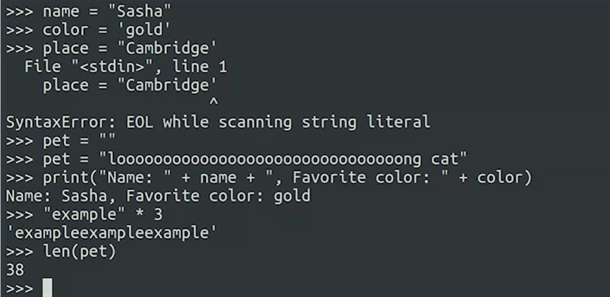
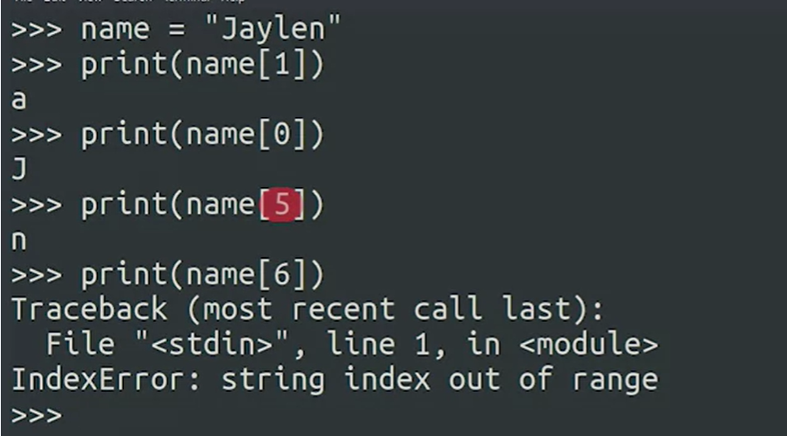
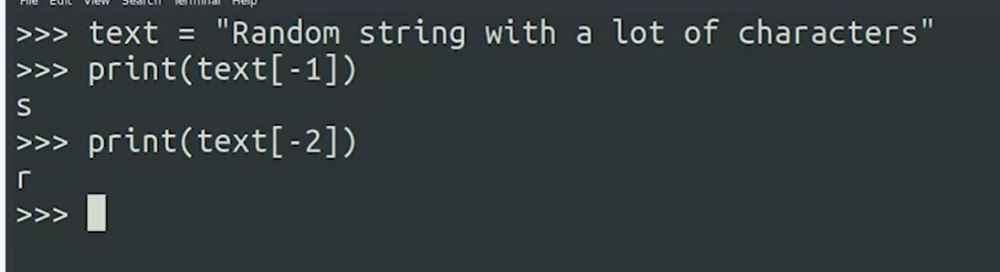
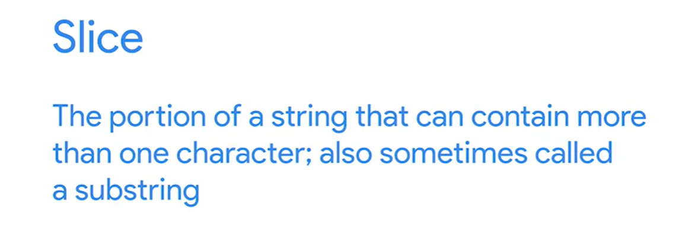
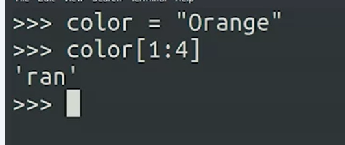
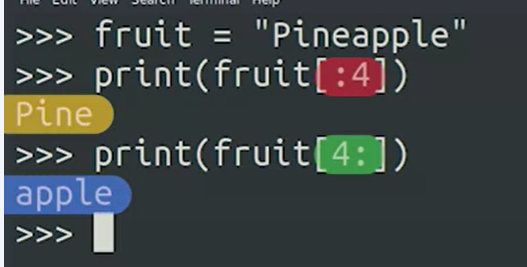

## Strings

Concetenation

Multiplation



*Modify the double_word function so that it returns the same word repeated twice, followed by the length of the new doubled word. For example, double_word("hello") should return hellohello10.*

````
def double_word(word):
    newword=word*2
    return (newword+str(len(newword)))

print(double_word("hello")) # Should return hellohello10
print(double_word("abc"))   # Should return abcabc6
print(double_word(""))      # Should return 0

````

### String Indexing

   

***Negative Indexng (Starting from last)***   

 

### Indexing and Slicing a Portion of the String

String indexing allows you to access individual characters in a string. You can do this by using square brackets and the location, or index, of the character you want to access. It's important to remember that Python starts indexes at 0. So to access the first character in a string, you would use the index [0]. If you try to access an index that’s larger than the length of your string, you’ll get an IndexError. This is because you’re trying to access something that doesn't exist! You can also access indexes from the end of the string going towards the start of the string by using negative values. The index [-1] would access the last character of the string, and the index [-2] would access the second-to-last character.

You can also access a portion of a string, called a slice or a substring. This allows you to access multiple characters of a string. You can do this by creating a range, using a colon as a separator between the start and end of the range, like [2:5]. 

This range is similar to the range() function we saw previously. It includes the first number, but goes to one less than the last number. For example:
````
>>> fruit = "Mangosteen"
>>> fruit[1:4]
'ang'
````
The slice includes the character at index 1, and excludes the character at index 4. You can also easily reference a substring at the start or end of the string by only specifying one end of the range. For example, only giving the end of the range:
````
>>> fruit[:5]
'Mango'
````
This gave us the characters from the start of the string through index 4, excluding index 5. On the other hand this example gives is the characters including index 5, through the end of the string:
````
>>> fruit[5:]
'steen'
````
You might have noticed that if you put both of those results together, you get the original string back!
````
>>> fruit[:5] + fruit[5:]
'Mangosteen'
````
Cool!

   

We do it using specifiying the range withing  colon-seperated patanthesez. 

       



